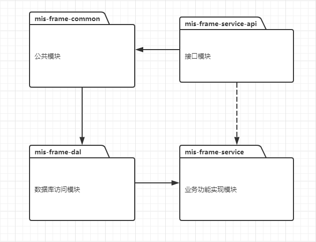

#MIS-FRAME-SERVER

##项目介绍
mis-frame-server是mis团队试行的非web项目项目.
项目目的:
1.统一规范
2.统一技术栈
3.统一风格
4.节省没必要的重复工作
###项目工程结构
```lua
seewo-mis-frame-server
|--mis-frame-common --功能模块
   |---constant
   |---exception
   |---util
|--mis-frame-dal -- 数据库接入层
   |---entity
   |---mapper
|--mis-frame-service-api -- rpc接口暴露层
   |---api
   |---dto
|--mis-frame-service --业务实现层
   |---service
```
mis后台项目命名规范："seewo-mis-"固定前缀 + 业务相关的名称 如：seewo-mis-frame-server
项目内模块命名规范:mis + "业务相关的名称,和项目对应" + 指定的后缀 如:mis-frame-common,具体参照以上项目结构
没什么特殊要求建议定义四个模块即可(common , dal, service-api,service)
模块间的依赖关系:


说明:
* mis-frame-service依赖mis-frame-dal,mis-frame-dal依赖mis-frame-common,mis-frame-common依赖mis-frame-service-api
  如果mis-frame-common没有必要依赖mis-frame-service-api则mis-frame-service可直接依赖mis-frame-service-api
* mis-frame-service-api只含有接口,网络传输的dto等,不能有任何业务逻辑在这一层

###技术选型
技术名称|参照资料
-----------------------------|--------------------------------------------
spring-boot|https://projects.spring.io/spring-boot/
Mybatis|http://www.mybatis.org/mybatis-3/zh/index.html   http://www.ityouknow.com/springboot/2016/11/06/springboot(%E5%85%AD)-%E5%A6%82%E4%BD%95%E4%BC%98%E9%9B%85%E7%9A%84%E4%BD%BF%E7%94%A8mybatis.html
zookeeper|http://zookeeper.apache.org/
redis|xxx
mysql|xxx
log4j2|xxx


redis使用规范:
todo

日志规范:
格式:
文件命名:
路径:
不同环境日志级别不一样:如开发环境打印sql


数据库规范;
* 参考:https://kb.cvte.com/pages/viewpage.action?pageId=77662860
* 和业务相关的数据表主键通过


